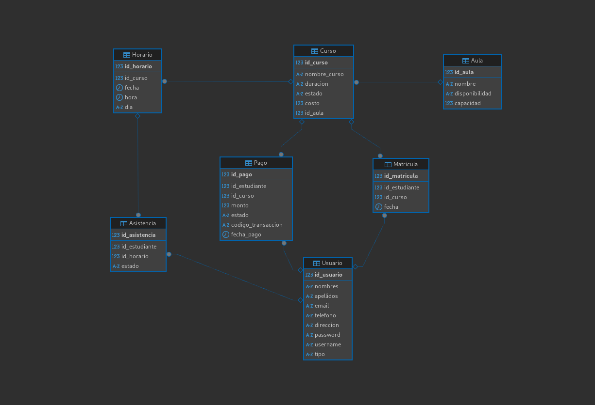

# Donde clonar si usan XAMPP o Laragon

Clonen el proyecto en la carpeta de su servidor web.

Si usan XAMPP, clonen en ./xampp/htdocs/

Si usan Laragon, clonen en ./laragon/www/

Si usan otro servidor web, clonen donde les parezca mejor.

# Modificar Datos de Conn.php

Cambien el nombre de la base de datos a la que vayan a usar en el archivo ./db/Conn.php.

# Estructura de los modulos (Arquitectura)

Cada modulo debe tener su propia carpeta dentro de ./modules/

Cada modulo debe tener archivos de modelos, controladores y vistas.

Los modelos deben contener la logica de acceso a datos.

Los controladores deben contener la logica de negocio.

Las vista deben contener la logica de presentacion.

# Base de Datos

# Funcionamiento de la Aplicación

Esta aplicación es un sistema de gestión de cursos y asistencias con dos tipos de usuarios: **Administradores** y **Estudiantes**.

## Roles y Funcionalidades:

### Administrador:
-   **Iniciar Sesión:** Acceso al panel de administración.
-   **Crear Cursos:** Puede definir nuevos cursos, incluyendo horarios y aulas.
-   **Registrar Asistencias:** Marcar la asistencia de los estudiantes inscritos a un curso por cada horario.

### Estudiante:
-   **Registrarse:** Crear una nueva cuenta de estudiante.
-   **Iniciar Sesión:** Acceder a su panel de estudiante.
-   **Inscribirse a Cursos:** Simular un proceso de pago para inscribirse en cursos disponibles, generando una instancia de matrícula.
-   **Revisar Asistencias:** Visualizar su historial de asistencias en los cursos inscritos.

## Cómo Empezar:

1.  **Configuración de la Base de Datos:**
    *   Importe el archivo `db.sql` en su gestor de bases de datos (por ejemplo, phpMyAdmin, MySQL Workbench).
    *   Asegúrese de que los datos de conexión en `db/Conn.php` coincidan con su configuración de base de datos.

2.  **Acceso a la Aplicación:**
    *   Una vez configurado el servidor web y la base de datos, acceda a la aplicación a través de la URL de su servidor local (ej. `http://localhost/`).
    *   Utilice las credenciales predefinidas en `db.sql` para el usuario administrador o regístrese como un nuevo estudiante.
